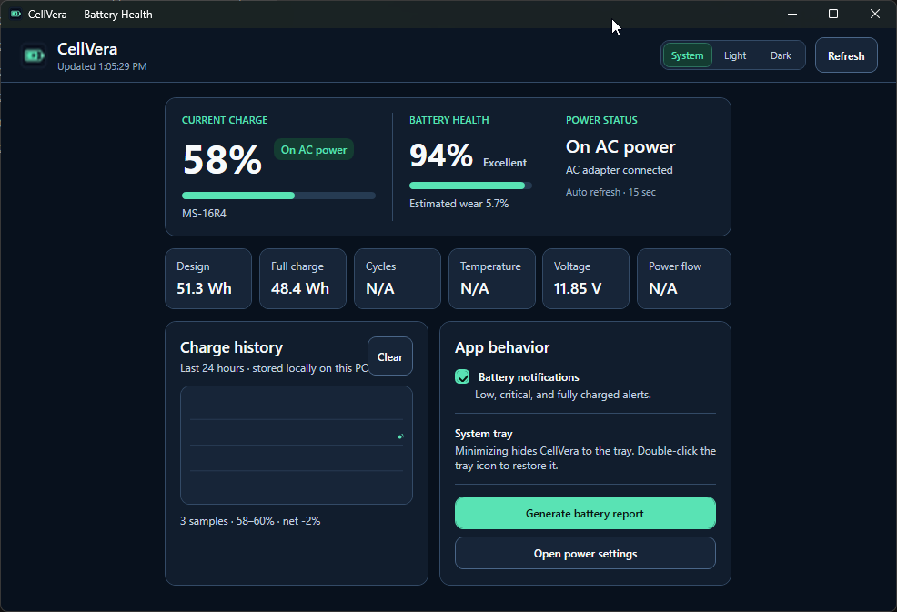

# CellVera

<!-- Replace lamerock with your GitHub username before publishing. -->

[](https://github.com/lamerock/CellVera/actions/workflows/build.yml)
[](https://github.com/lamerock/CellVera/releases/latest)
[](https://dotnet.microsoft.com/)
[](https://www.microsoft.com/windows)
[](https://learn.microsoft.com/dotnet/desktop/wpf/)
[](LICENSE)

**A compact, OEM-neutral battery health and power dashboard for Windows laptops.**

CellVera shows the battery information Windows and your laptop firmware expose in one focused desktop app. It combines live charge status, battery health, capacity details, charge history, tray controls, notifications, Windows battery reports, and System/Light/Dark appearance modes without depending on manufacturer-specific utilities.

> CellVera is an independent project and is not affiliated with Lenovo, Microsoft, or any laptop manufacturer.

<p align="center">
  
</p>

> **Screenshot placeholder:** replace `docs/cellvera-screenshot-placeholder.png` with a real screenshot using the same filename when the UI is ready for release.

## Features

| Area | What CellVera provides |
| --- | --- |
| Battery status | Charge percentage, charging/discharging state, power source, and estimated runtime when available |
| Battery health | Health percentage and estimated wear based on design and full-charge capacity |
| Technical details | Design capacity, full-charge capacity, cycle count, temperature, voltage, and charge/discharge rate when exposed by the device |
| Charge history | Lightweight local history with a 24-hour chart and up to 30 days of retained samples |
| Notifications | Optional low-battery, critical-battery, and fully-charged notifications with duplicate suppression |
| System tray | Minimize to tray with Open, Refresh, and Exit actions |
| Windows tools | Generate the built-in Windows battery report and open Power & battery settings |
| Appearance | System, Light, and Dark themes, including native title-bar theming |
| Refresh | Automatic background refresh without blocking the main UI during WMI reads |

## Download

For normal use, download the latest release from **GitHub Releases**:

**Installer:** `CellVera-Setup-x.y.z.exe`  
**Portable build:** `CellVera-x.y.z-win-x64-portable.zip`

> Before publishing this README, replace `lamerock` in the badges and release links with your GitHub username.

### Installer

The installer is the recommended option for most users. It installs CellVera for the current Windows user and creates normal Start Menu/uninstall entries.

### Portable build

The portable package can be extracted and run directly. The published build is self-contained, so users do not need to install the .NET runtime separately.

## Requirements

### Running CellVera

- Windows 10 or Windows 11
- 64-bit Windows (`x64`)
- A laptop battery exposed through Windows battery/WMI interfaces

### Building from source

- .NET 8 SDK
- Visual Studio 2022 with the **.NET desktop development** workload, or the .NET CLI
- Inno Setup 6 only if you want to build the installer locally

## Appearance

CellVera provides three appearance modes:

- **System** — follows the Windows app theme and reacts to theme changes while CellVera is open.
- **Light** — always uses the CellVera light palette.
- **Dark** — always uses the CellVera dark palette.

The selected mode is saved locally in:

```text
%LOCALAPPDATA%\CellVera\settings.json
```

## Battery notifications

Notifications are optional and are designed to avoid repeated alerts. Current defaults are:

- **20%** — low-battery warning
- **10%** — critical-battery warning
- **100% while plugged in** — fully charged notification

A notification does not repeatedly fire on every refresh. Its state resets only after the battery meaningfully leaves that condition.

## Charge history and local data

CellVera stores its own settings and history locally under:

```text
%LOCALAPPDATA%\CellVera\
```

Typical files include:

```text
settings.json
charge-history.json
notifications.json
```

CellVera does **not** require an account or cloud service. Battery history and preferences stay on the local PC unless the user chooses to copy or share those files.

## Hardware compatibility

Windows exposes basic battery information on most laptops, but richer values depend on the battery, firmware, ACPI implementation, and device drivers.

The following values may be unavailable on some systems:

- Cycle count
- Battery temperature
- Charge/discharge rate
- Design capacity
- Full-charge capacity

When a value is not exposed, CellVera displays **Not available** rather than inventing or estimating unsupported data.

Charge thresholds, conservation modes, and vendor-specific battery controls are intentionally not changed through undocumented OEM interfaces.

## Build from source

Clone the repository and restore dependencies:

```powershell
git clone https://github.com/lamerock/CellVera.git
cd CellVera
dotnet restore
```

Build a Release configuration:

```powershell
dotnet build -c Release
```

Or use the included release script:

```powershell
Set-ExecutionPolicy -Scope Process -ExecutionPolicy Bypass
.\build-release.ps1
```

The release script creates a self-contained Windows x64 publish folder under `dist/`.

### Visual Studio

1. Open `CellVera.csproj`.
2. Allow restore to complete.
3. Select **Build > Rebuild Solution**.
4. Run with **F5** or **Ctrl+F5**.

## CI and releases

CellVera uses GitHub Actions for continuous integration and releases.

- `.github/workflows/build.yml` validates pushes and pull requests against `main`.
- `.github/workflows/release.yml` creates a self-contained x64 build, portable ZIP, Inno Setup installer, SHA-256 checksums, and GitHub Release for version tags such as `v1.0.2`.

A typical release flow is:

```text
feature/fix branch
      ↓
pull request
      ↓
build passes
      ↓
merge to main
      ↓
tag vX.Y.Z
      ↓
automated GitHub Release
```

## Project structure

```text
CellVera/
├── .github/
│   ├── ISSUE_TEMPLATE/
│   └── workflows/
├── Assets/
│   └── CellVera.ico
├── docs/
│   └── cellvera-screenshot-placeholder.png
├── Models/
├── Services/
├── App.xaml
├── App.xaml.cs
├── MainWindow.xaml
├── MainWindow.xaml.cs
├── CellVera.csproj
├── CellVera.iss
├── build-release.ps1
├── CONTRIBUTING.md
├── CODE_OF_CONDUCT.md
├── SECURITY.md
├── LICENSE
└── README.md
```

## Contributing

Contributions are welcome. Please read [CONTRIBUTING.md](CONTRIBUTING.md) before opening a pull request.

For bugs, include your Windows version, laptop model when relevant, the affected CellVera version, and whether the issue occurs in the installer or portable build. Do not attach files that contain private information unless you have reviewed them first.

## Security

Please do not report suspected security vulnerabilities in a public issue. See [SECURITY.md](SECURITY.md) for the preferred reporting process.

## Code of conduct

Participation in the project is governed by [CODE_OF_CONDUCT.md](CODE_OF_CONDUCT.md).

## License

CellVera is licensed under the [MIT License](LICENSE).

Copyright © 2026 CellVera contributors.

