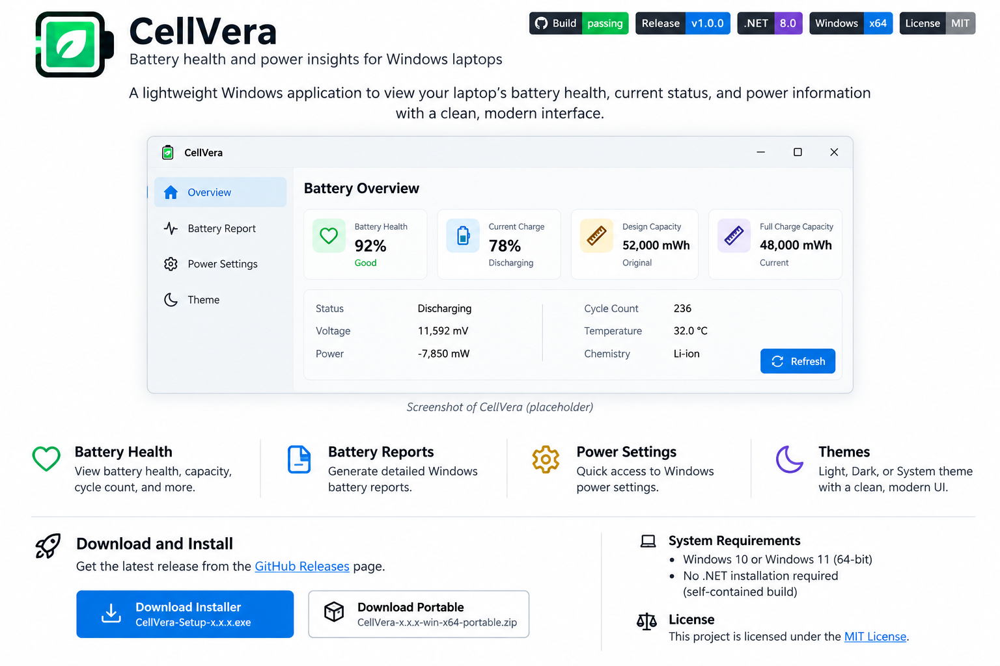

# CellVera

<!-- Replace YOUR_USERNAME in the GitHub badges/links below with your GitHub username. -->

[](https://github.com/YOUR_USERNAME/CellVera/actions/workflows/build.yml)
[](https://github.com/YOUR_USERNAME/CellVera/releases)
[](https://dotnet.microsoft.com/)
[](https://www.microsoft.com/windows)
[](https://learn.microsoft.com/dotnet/desktop/wpf/)
[](#requirements)

**Battery health and power insights for Windows laptops.**

CellVera is a focused Windows laptop battery dashboard for battery health, charge status, capacity, electrical details, and Windows power tools. It is OEM-neutral and does not depend on Lenovo or other manufacturer-specific services.

## Screenshot

<p align="center">
  
</p>

> **Placeholder:** Replace `docs/cellvera-screenshot-placeholder.png` with a real CellVera screenshot when the UI is ready for release. Keep the same filename and the README will update automatically.

## Highlights

- Live charge percentage, power source, battery state, and estimated runtime.
- Battery health and estimated wear when design/full-charge capacity are exposed by the laptop firmware.
- Design capacity, full-charge capacity, cycle count, temperature, voltage, charge rate, and discharge rate when available.
- Records a lightweight local 24-hour charge history and retains up to 30 days of samples.
- System tray support with Open, Refresh, and Exit actions; minimizing hides CellVera to the tray.
- Optional battery notifications at 20%, 10%, and when charging reaches full.
- Generates the built-in Windows HTML battery report.
- Opens Windows Power & battery settings.
- Refreshes automatically every 15 seconds without blocking the UI thread during WMI reads.
- Custom CellVera application icon is embedded in the window and `CellVera.exe`.

## Appearance

CellVera includes three explicit appearance modes:

- **System** — follows the Windows app theme and reacts when Windows switches between light and dark while CellVera is open.
- **Light** — always uses CellVera's high-contrast light palette.
- **Dark** — always uses CellVera's high-contrast dark palette.

The selected mode is saved to:

```text
%LOCALAPPDATA%\CellVera\settings.json
```

System is the default on first launch. The app background, cards, controls, and native title bar follow the effective light/dark palette.

## Download

For normal use, download the latest installer or portable package from the project's **GitHub Releases** page.

After replacing `YOUR_USERNAME` in this README, this link will point to your releases:

```text
https://github.com/YOUR_USERNAME/CellVera/releases
```

## Requirements

### To run a published build

- Windows 10 or Windows 11, 64-bit
- No separate .NET installation required for the self-contained build

### To build from source

- .NET 8 SDK
- Visual Studio 2022 with **.NET desktop development**, or the .NET CLI

## Build in Visual Studio

1. Open `CellVera.csproj`.
2. Allow NuGet restore to complete.
3. Choose **Build > Rebuild Solution**.
4. Run with **F5** or **Ctrl+F5**.

## Build a standalone EXE from PowerShell

If PowerShell blocks local scripts for the current session:

```powershell
Set-ExecutionPolicy -Scope Process -ExecutionPolicy Bypass
```

Then build:

```powershell
cd D:\CellVera
.\build-release.ps1
```

Each release is written to a fresh timestamped folder, for example:

```text
dist\CellVera-20261006-120000\CellVera.exe
```

Using a new publish directory prevents a running older copy of `CellVera.exe` from locking the output file and breaking the next publish.

## Hardware support

Windows exposes basic battery state on most laptops, but richer values depend on the firmware and battery driver. Cycle count, temperature, charge/discharge rate, design capacity, or full-charge capacity may not be exposed on every machine. CellVera displays **Not available** instead of estimating unsupported values.

Charge thresholds and conservation modes are manufacturer-specific. CellVera intentionally does not attempt to change OEM charging limits through undocumented interfaces.

## Project structure

```text
CellVera/
├── Assets/
│   └── CellVera.ico
├── docs/
│   └── cellvera-screenshot-placeholder.png
├── Models/
│   ├── BatterySnapshot.cs
│   └── ChargeHistoryEntry.cs
├── Services/
│   ├── BatteryNotificationService.cs
│   ├── BatteryService.cs
│   ├── ChargeHistoryService.cs
│   ├── ThemeService.cs
│   └── TrayService.cs
├── App.xaml
├── App.xaml.cs
├── MainWindow.xaml
├── MainWindow.xaml.cs
├── CellVera.csproj
├── README.md
└── build-release.ps1
```

- `MainWindow.xaml` — compact single-dashboard interface, history chart, notification control, and appearance selector.
- `MainWindow.xaml.cs` — refresh workflow, local history rendering, tray behavior, notifications, and Windows tool actions.
- `Services/BatteryService.cs` — Windows/WMI battery data retrieval.
- `Services/ThemeService.cs` — System/Light/Dark theme selection, persistence, and title-bar theming.
- `Services/ChargeHistoryService.cs` — throttled local charge-history persistence.
- `Services/BatteryNotificationService.cs` — low/critical/full notification rules and opt-out preference.
- `Services/TrayService.cs` — Windows system tray icon and actions.
- `Models/BatterySnapshot.cs` — battery data model and health calculations.
- `Models/ChargeHistoryEntry.cs` — local history sample model.
- `Assets/CellVera.ico` — executable/window icon.
- `build-release.ps1` — self-contained x64 release publisher.

## GitHub badge setup

Before publishing the README, replace every occurrence of:

```text
YOUR_USERNAME
```

with your actual GitHub username. The **Build** badge will then reflect `.github/workflows/build.yml`, and the **Release** badge will show the latest tagged GitHub release.
